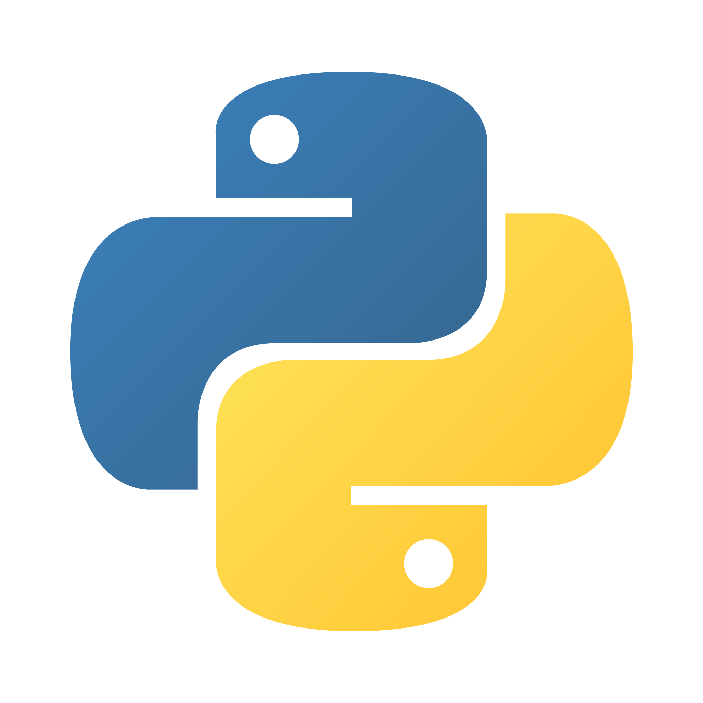
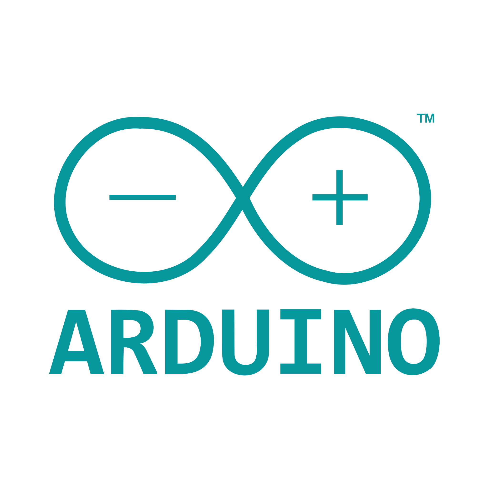

# Alexander Kantuni

With 4+ years of programming experience I have acquired the following skills:

        

#### Projects:

- Amazon Checkout Engine
- 500+ Programming problems solved
- Quora Data Scraper
- Andriod game automation
- Restock and new-drop monitoring foftware for 10 online retail stores each with 1M+ daily users
- Helped develop logic for model car lighting effects
- Discord advertisement bot

#### Internships:

- Part-Time Intern at [Teamable](https://www.teamable.com/) (February - March 2020)

#### Questions Answered on Stack Overflow: 35

#### Certificates:

- [W3Cx HTML5.0x Certificate of Achievement](https://courses.edx.org/certificates/707fd3bcb6f14627b26df79dcc34e478)

#### Links:

